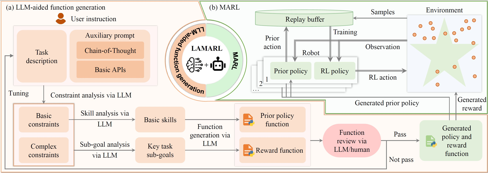

# LAMARL: LLM-Aided Multi-Agent Reinforcement Learning for Cooperative Policy Generation

**[Guobin Zhu](https://github.com/Guobin-Zhu)1,2, [Rui Zhou]()1, [Wenkang Ji]()2, [Shiyu Zhao](https://www.westlake.edu.cn/faculty/shiyu-zhao.html)2**

1Beihang University &nbsp;&nbsp;&nbsp; 2Westlake University

---

## 🚀 **Quick Access**

| Resource | Link |
|:--------:|:----:|
| 💻 **Code** | [GitHub Repository](https://github.com/Guobin-Zhu/MARL-LLM) |
| 🎥 **Video** | [YouTube Demo](https://youtu.be/HoYk70Ksy8w) |

---

## 🎯 **Method Overview**

 
  
 <em>LAMARL Framework</em>

---

## 📖 **Abstract**

This paper introduces **LAMARL**, a novel approach that integrates Multi-Agent Reinforcement Learning (MARL) with Large Language Models (LLMs) to enhance sample efficiency and automate function generation for multi-robot cooperative tasks. 

### Key Achievements:
- 🎯 **185.9%** improvement in sample efficiency on average
- 🤖 Fully automated prior policy and reward function generation
- 🔧 **28.5%-67.5%** improvement in LLM output success rates through structured prompting
- ✅ Validated on both simulation and real-world shape assembly tasks

---

**⭐ Star this repo if you find it useful! ⭐**

